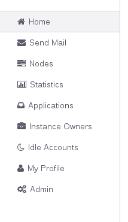
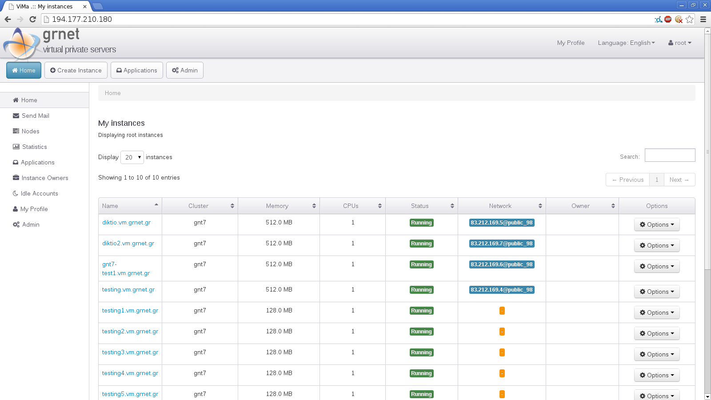
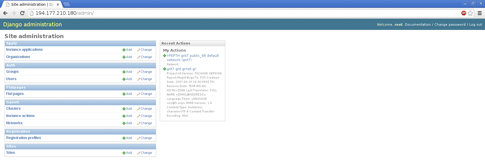
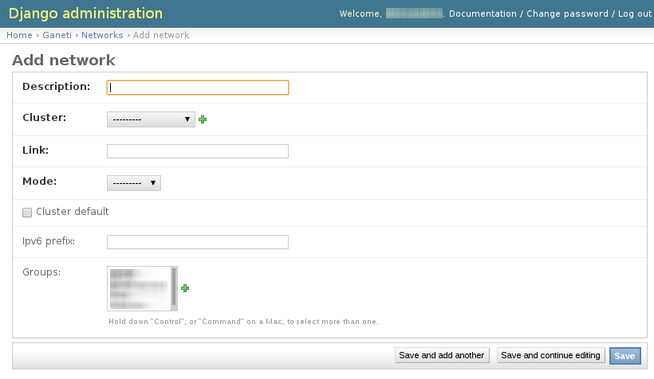

*******************
Administrator guide
*******************

Cluster Setup
#############

ganetimgr needs a set of RAPI credentials to communicate with a cluster. These need to be created manually.
The next steps need to be repeated for every cluster you wish to administer with ganetimgr.

Create (or edit if it already exists) the ``/var/lib/ganeti/rapi/users`` file on every node at the cluster like this::

	<user> <pass> write

You can replace ``write`` with ``read`` so that ganetimgr can only view the cluster resources, but most of the ganetimgr functionality will be disabled.

=====================================================================

Login to the ganetimgr platform and go to the admin interface. You can do so from the sidebar:

Select the ``cluster`` option from the Ganeti section.

From here you can manage the you cluster pool. Normally this list is empty now. Select the “Add” cluster option:

An explanation about some of the settings:

- ``Hostname`` is the fully qualified domain name of the cluster
- ``Slug`` is a friendly name for the cluster
- ``Port`` is the port the RAPI daemon listens to on the master node. Unless you manually changed it this should be 5080
- ``Username/Password`` are the credentials created earlier for the cluster
- ``Fast instance creation`` is an option to submit instance creation requests through the admin interface instead of going through the normal application procedure.
- ``Cluster uses gnt-network`` is a soon to be deprecated option about network options for new instances. If you use routed networks (though gnt-network) this should be on.

Network Setup
#############

ganetimgr autodiscovers any network available through gnt-network on the cluster during the instance creation. You can also hardcode any other networks (e.g. bridged vlans) from the admin interface

- Link is the name of the network device found on the cluster.
- Mode is the network mode for the interface can be routed or bridged.
- Groups ties the network to a specific user group. When a user from that group submits an application this network is autoselected.

Oauth2
######
We have integrated oauth2 support.

API
***
The endpoints the api provides are::

	/instances/list/

which fetches all the instances of the current user. Optionally the api user can pass a get parameter named 'tag' which filters all instances by the specific tag.

E.g::

 	/instances/list/?access_token=CUST0MT0k3N&tag=ganetimgr:filterby:thistag

will fetch us only the instances tagged with "ganetimgr:filterby:thistag"

And::

 	/user/details/

which lists user details (username, email, password, id)

Configuring oauth2
******************
In order to add oauth2 you have to install:

* django-cors-headers==1.1.0
* django-oauth-toolkit==0.5.0

And insert in installed apps:

* oauth2_provider
* corsheaders

Using oauth2
************

* Hit /o/applications and create a new one.
* Create a new application with implicit authorization grant type
* Set the redirect urls to the desired ones
* by hitting /o/authorize?redirect_uri=<redirect_uri>&client_id=<client_id>&response_type=token&scope=read you get a response with the token.
* by adding the access_token in the request to /instances/lists/?access_token=<token> you get a list of all the user instances.

Translations
############
ganetimgr uses Django's translation system. We have created translations in Greek. In order to create translations
to another language you have to follow these instructions_.

.. _instructions: https://docs.djangoproject.com/en/1.4/topics/i18n/translation/#localization-how-to-create-language-files
