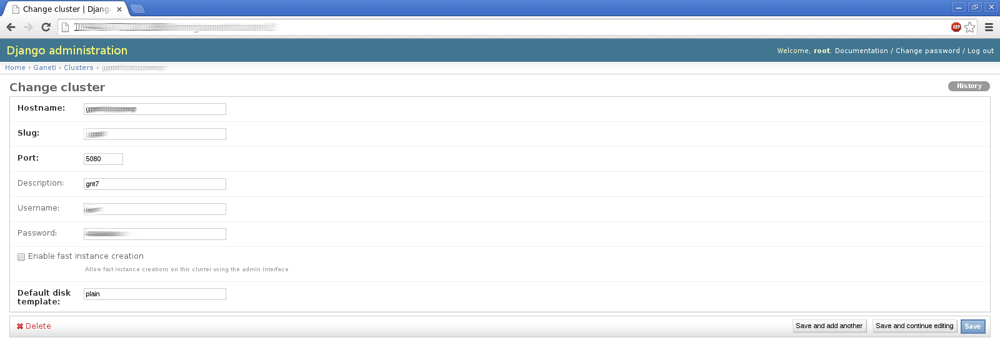

ganetimgr admin guide
=====================

ganeti admin
------------
We create the /var/lib/ganeti/rapi/users at the ganeti master node with::

	<user> <pass> write

Login to the ganetimgr platform. From the side menu select **Admin**

.. image:: _static/images/image00.png

Click at the “Admin” link. You should see the admin interface.

.. image:: _static/images/image01.png
	:scale: 50 %

Click at the “Clusters” link. You should see a list of the available clusters. Now it's time to add one or more clusters.
Select the “Add” cluster option

.. image:: _static/images/ss2_clusterview.png
	:scale: 50 %

edit the details

Go back to the admin dashboard, then add the network

.. image:: _static/images/image04.png
	:scale: 50 %

You are done!

