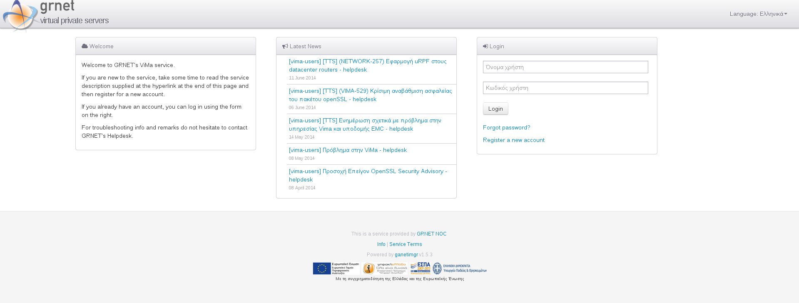

.. ganetimgr documentation master file, created by
   sphinx-quickstart on Thu Oct 31 10:48:21 2013.
   You can adapt this file completely to your liking, but it should at least
   contain the root `toctree` directive.

Welcome to ganetimgr's documentation!
=====================================

What is ganetimgr?
==================
ganetimgr is a Django project that serves as an administration frontend for (multiple) Ganeti clusters. It is developed as
the frontend of a VPS service.

A simplified architecture of ganetimgr is depicted here::

	+------------------------+           +---------------+
	|                        |           |               |
	|                        |     +-----+ ganeti cluster|
	|         Django         |     |     |               |
	|                        |     |     +---------------+
	|                        |     |            ...
	+------------------------+     |            ...
	|     gevent watcher     |     |            ...
	|                        |     |     +---------------+
	+------------------------+     |     |               |
	|  Caching  |ganeti REST +-----+     + ganeti cluster|
	|           |API client  +-----------+               |
	+-----------+------------+           +---------------+

Installation
============
You can go through the installation at the :doc:`Install ganetimgr <install>` section.

Upgrading
=========
If running an older version, look through the :doc:`Upgrade Notes <upgrade>` before upgrading to a new one.

Compatibility
=============
ganetimgr has been tested with ganeti versions 2.4-2.9. Due to the nature of the Ganeti RAPI, ganetimgr should be able to communicate with any Ganeti v.2.X cluster.

Some ganeti changes that are required for some of ganetimgr's features to work, see :doc:`Ganeti Patches <ganeti>`

Table of Contents
=================

.. toctree::
   :maxdepth: 2

   install
   admin
   ganeti
   upgrade
   interface
