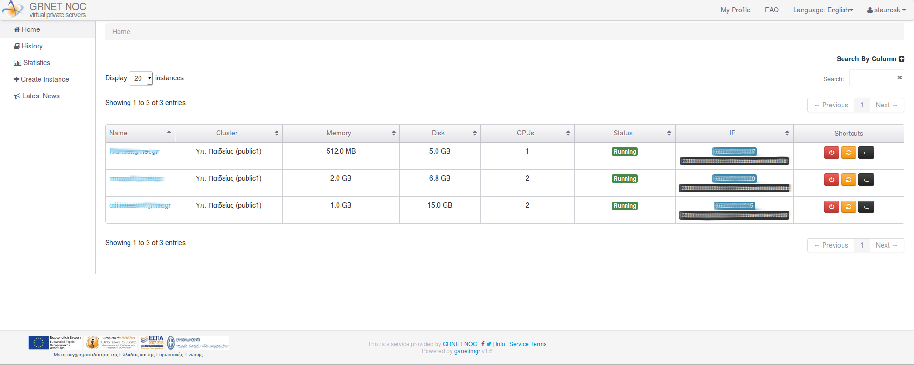
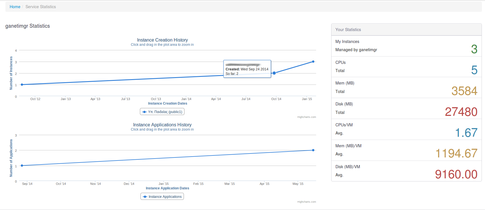
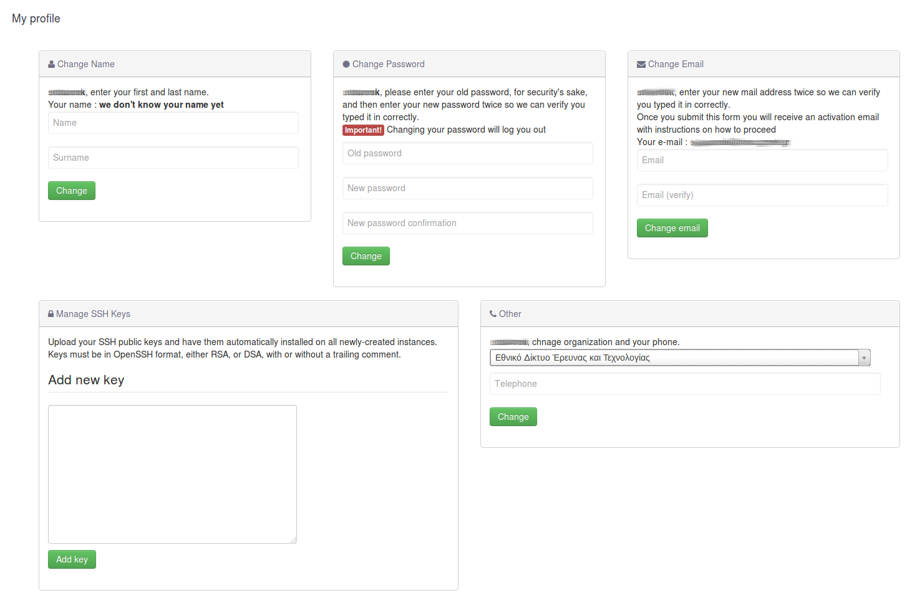
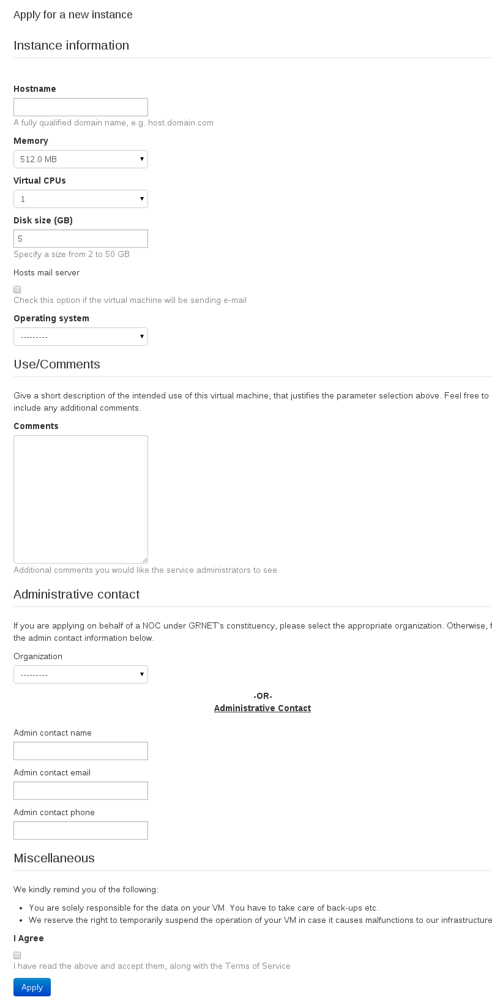
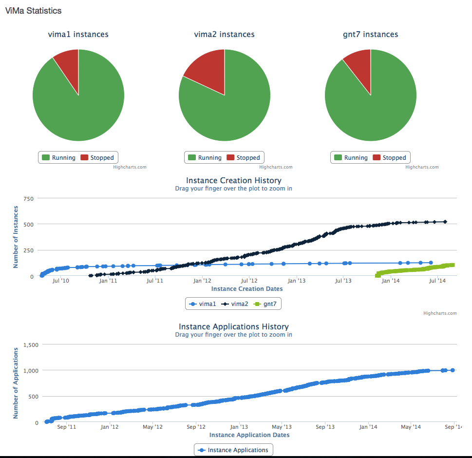

===============
Interface Guide
===============

This document showcases some of ganetimgr's features from the user's and administrator's perspective.

ganetimgr is the frontend to a VPS service, albeit without a pricing component. A regular user has access to administrer only the vms assigned to them. An administrator can view and administer every resource. There is a permissions system that can be configured to provide seperate access levels.
A user can't create a vm by themself, they needs to submit an instance application which needs to be approved by an administrator for the vm to be created.

User View
=========

Main view
---------
The Home view presents a table with every vm owned by the user with some basic information for quick sorting. There are also actions shortcuts for basic interaction.

Statistics
----------
There is a statistics view that shows graphs and data about the user (stats , accumulated resources, instance applications, etc...)

	
Profile
-------
This is the profile settings page. The user can change the profile full name, the password or the registered email address. Also SSH key management.
The SSH keys defined here are auto-injected to the vms when an instance application is approved by the admins.

New Application
---------------
The instance application form. The user requests the resources needed and contact information.

Admin view
==========

The administrator has access to quite a few more views.

Main view
---------
The admin main view lists all the vms from all the clusters ganetimgr knows about. The interaction with the vm is the same as a regular users.

Statistics
----------
The statistics page shows data from all the clusters that ganetimgr knows about. There is a view for administrering applications (approving/denying the pending ones, viewing past ones), viewing interesting users (users and vm associations, inactive users, etc...).

Notifications
-------------
An administrator can direclty send mail to vm owners. The Recipient field is dynamic. It can lookup a usernames email address dynamically and also fetch all the emails associated with a vm or even all the vms the reside on a cluster.

.. image:: _static/images/ss_15_admin_mail.png
	:scale: 50 %
