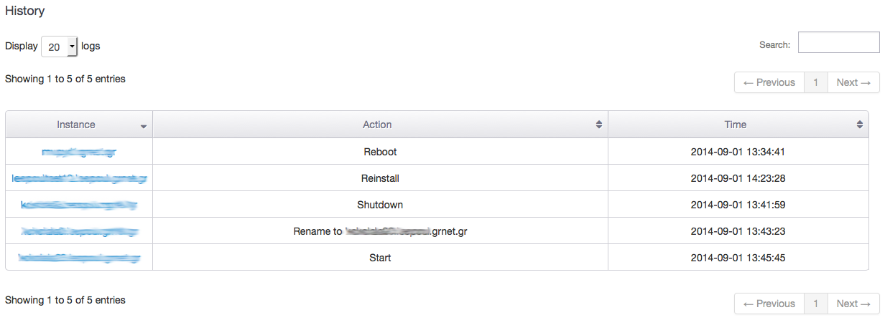
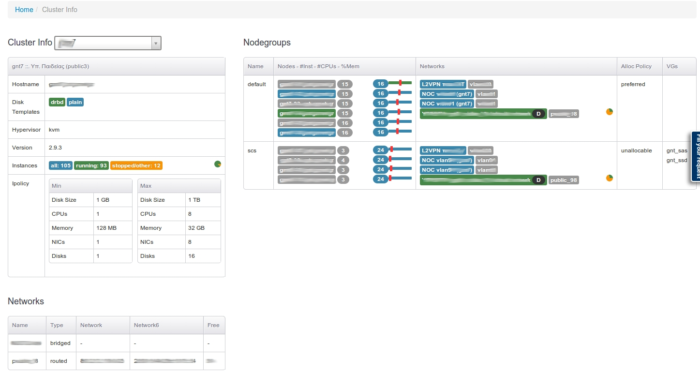
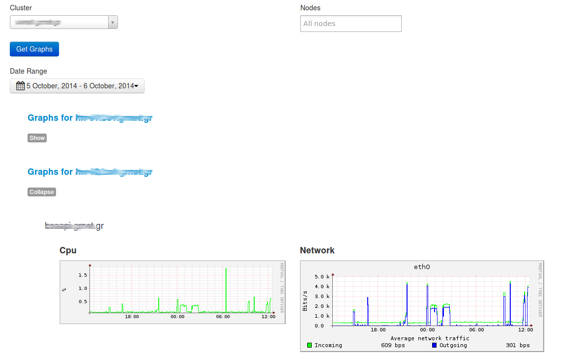
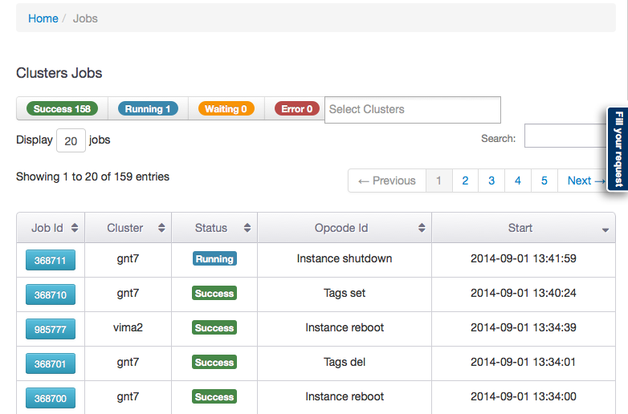
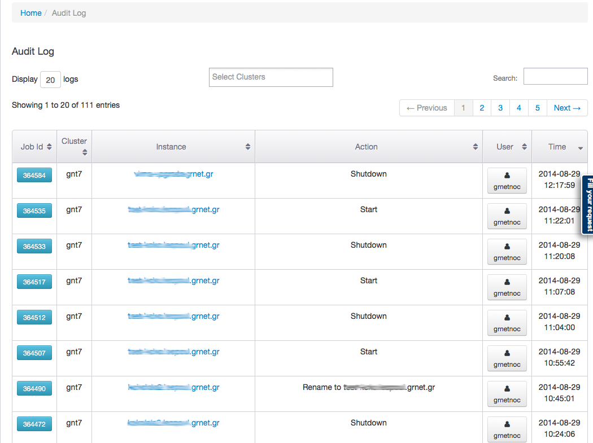
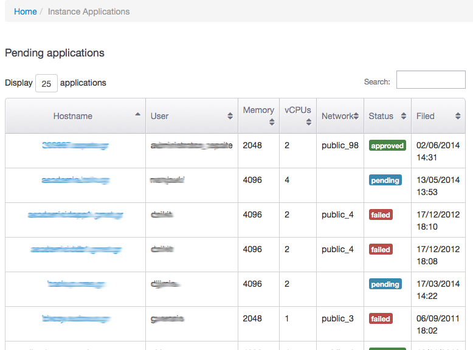
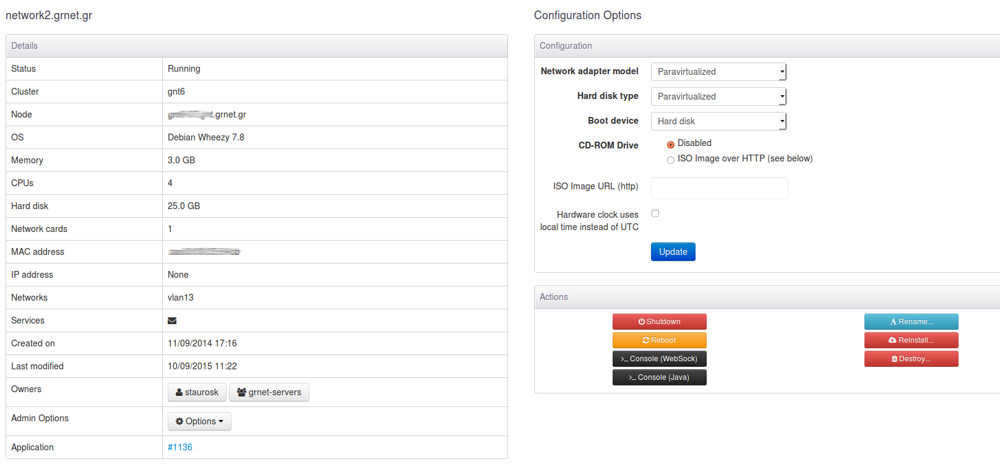

===============
Interface Guide
===============

This document showcases some of ganetimgr's features from the user's and administrator's perspective.

- ganetimgr is the frontend to a VPS service, albeit without a billing/accounting component. 
- Regular users have access to manage only the VMs assigned to them or to their group.
- An administrator can view and manage every resource.
- There is a permissions system that can be configured to provide refined access levels (helpdesk views).

Instance creation workflow
--------------------------
A user can't directly create a VM since there are no quotas assigned to the users. A user needs to submit an *instance application* which then needs to be *approved* by an administrator of the service for the VM to be created.

User View
^^^^^^^^^

Main view
---------
The Home view presents a table with every VM owned by the user with some basic information for quick sorting. There are also actions shortcuts for basic interaction.

.. image:: _static/images/ss_02_user_main_view.png
	:scale: 50 %

Statistics
----------
There is a statistics view that shows graphs and data about the user (stats , accumulated resources, instance applications, etc...)

.. image:: _static/images/ss_03_user_statistics.png
	:scale: 50 %

Profile
-------
This is the profile settings page. The user can change the profile full name, the password or the registered email address. Also SSH key management.
The SSH keys defined here are auto-injected to the VMs when an instance application is approved by the admins.

.. image:: _static/images/ss_04_user_profile.png
	:scale: 50 %

New Application
---------------
The instance application form. The user requests the resources needed and contact information.

.. image:: _static/images/ss_05_user_application.png
	:scale: 50 %

History
-------

User can view a timeline of the events for all his vms.

Permissions
^^^^^^^^^^^
The are three extra permissions for non-administrative users:

Can view all instances
----------------------
When a user has this permission, they can view all instances.

Can Lock
--------
Combined with the above permission, they can lock an instance.

Can Isolate
--------
Combined with the 'can view all instances' permission, they can isolate an instance.

Admin view
^^^^^^^^^^

The administrator has access to quite a few more views.

Main view
---------
The admin main view lists all the VMs from all the clusters ganetimgr knows about. The interaction with the VM is the same as a regular users.

Cluster Info
------------
Real-time lookup of cluster-wide properties of a specific cluster.

Nodes view
----------

List of all available hardware nodes with important resources for easy sorting. Ability to filter based on Ganeti node status (master, master-candidate, regular, drained, offline).

.. image:: _static/images/ss_10_admin_node.png
	:scale: 50 %

Batch Graphs
------------

List all instances cpu and network graphs, per cluster or per node. You can collapse and expand the graphs per instance and one can select graphs between a specific time period.

Jobs
----
Real-time view of the cluster(s) job queue. Ability to sort based on job status (running, success, failed, waiting) and per cluster).

Audit Log
---------

Logging of vm-related user initiated events such as Instance shutdown/reboot/startup/

Applications
------------

Statistics
----------
The statistics page shows data from all the clusters that ganetimgr knows about. There is a view for administering applications (approving/denying the pending ones, viewing past ones), viewing interesting users (users and VM associations, inactive users, etc...).

.. image:: _static/images/ss_11_admin_stats.png
	:scale: 50 %

Instance Details
----------------
There is an instance details page, which shows the basic information of an instance to a user.
A user has permission to make some actions to the instances he or the groups he is in owns.

- Shutdown Instance

- Reboot Instance

- Can have console access (VNC/NoVNC):
	A vnc console (java applet) and a novnc console can be given to the user
	in order to use the VM remotely through ganetimgr. There is also a text
	area (NoVNC) in case one needs to paste some commands and easily send them to the
	virtual machine

- Rename Instance

- Reinstall Instance

- Destroy

Fatal actions require email verification.

Notifications
-------------

An administrator can directly send mail to VM owners. The Recipient field is dynamic. It can lookup a username's email address dynamically and also fetch all the emails associated with a VM or even all the VMs the reside on a cluster.
We have added the variable `instances` in the context of the message (where applicable, eg clusters) in order to show the names of a users affected instances.
In this section there is also the archive where one can see all the previous notifications sent by the admins.

.. image:: _static/images/ss_15_admin_mail.png
	:scale: 50 %
